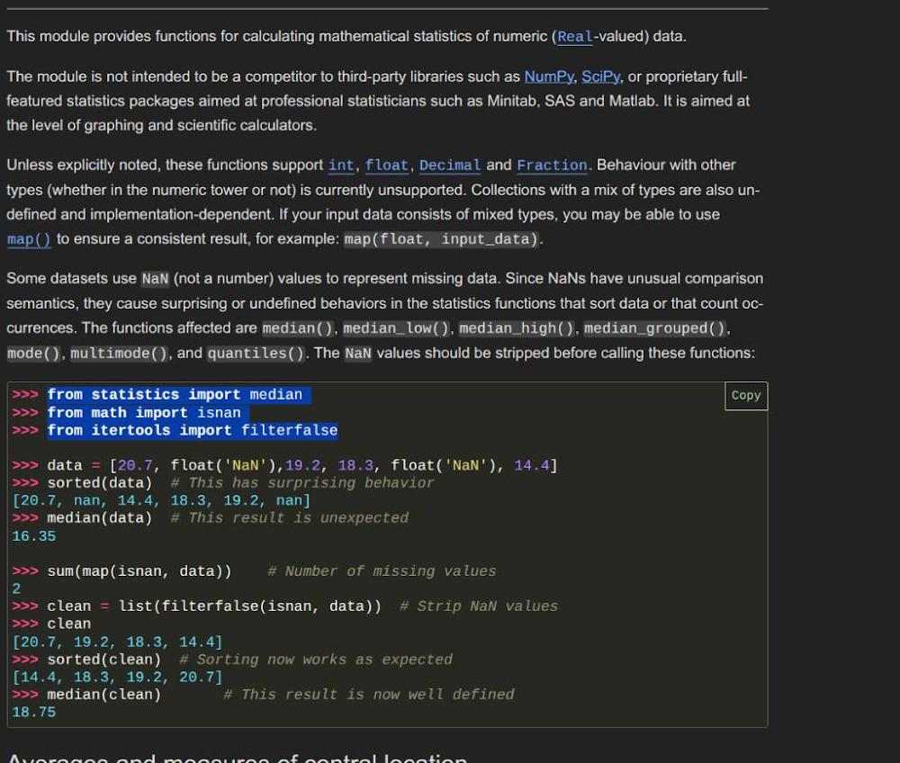
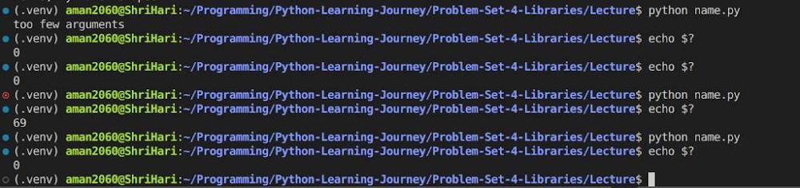
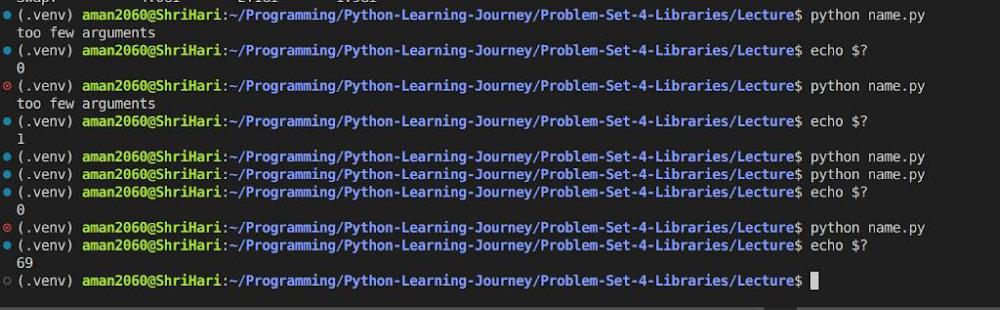

#  what are modules and libraries 
 In Python, a module is a single file containing code, while a library is a collection of related modules grouped together. [1, 2, 3] 
### ⏱️ Short Difference

* Module: A single .py file. It is a single brick.
* Library: A collection of files/packages. It is the whole building. [4, 5, 6] 
* 

------------------------------
### 📘 What is a Module?
A module is simply a text file ending in .py that contains Python code (functions, classes, or variables) written by someone else that you can reuse in your program so you do not have to write it from scratch. [7, 8, 9, 10, 11] 

* Example: The built-in math module.
* Code Example: [12] 
* 

import math
## Uses the 'sqrt' function from the 'math' module
print(math.sqrt(16))  # Output: 4.0

### 📚 What is a Library?
A library is a much larger collection of code. It contains multiple modules and packages bundled together to perform complex, specific tasks like data analysis, web scraping, or game development. [13, 14, 15, 16, 17] 

* Example: Requests (for opening web links) or Pandas (for data science).
* Code Example: [18, 19, 20, 21, 22] 
* 

import requests
## Uses a whole library to fetch data from a websiteresponse = requests.get("https://github.com")
print(response.status_code)  # Output: 200

------------------------------
### 📦 Quick Clarification: "Volumes" vs "Packages"
You mentioned the word "volumes"—in Python programming, we do not use the term "volumes." It is highly likely you meant Packages.

* A Package is a folder that holds multiple modules together.
* A Library is made up of these packages. [23, 24] 

### 📊 Summary Table

| Feature [25, 26]          | Module                        | Package                           | Library |
|---                        |---                            |---                                |---|
| What is it?               | A single .py file             | A folder of modules               | A collection of packages |
| Size                      | Smallest unit                 | Medium                            | Largest unit |
| Example                   | math.py                       | A folder named effects            | NumPy or Django |

# Random Library

The random Library
This is a built-in Python module used to generate pseudo-random numbers for games, choices, and simulations. 
Here are its four most common functions:
random.random()
Generates a float between 0.0 and 1.0. 
random.randint(start, end)
Generates a whole number between the two limits (inclusive). 
random.choice(sequence)
Picks one random item from a list or string. 
random.shuffle(list)
Mixes up the order of items in a list.

# import Keyword 
But how do you go about loading a module into your own program so that you can use the functions in that module? Well, we need a new keyword in Python and namely it's import. The import keyword in Python allows you to import the contents of the functions from some module in Python. Well, how might I go about using this in practice? Well, let me propose that there exists in that random module this function among others. So I have copied and pasted from the documentation this summary of a function called Choice. Now, the function exists in the random module, so to speak, not a random module, the random module. And so generally the documentation describes it fully like this. random.choice is how you would technically call this function, though, we'll see alternatives to that.

In parentheses, there is a parameter called S-E-Q for sequence. And sequence generally means a list or something that is list-like if you have a list of numbers or strings or anything else. And the documentation elaborate. Well, how can I go about using this function to solve, perhaps, a familiar problem? Well, let me go ahead and open up VS Code here. And let me propose that we implement a program that simulates flipping a coin.

The import keyword brings outside code into your script, while the random library provides tools to generate unpredictable data. 
The import Keyword
Python keeps its built-in tools small to save memory. To use extra tools, you must explicitly load them using import. 
Purpose: Opens access to external files, packages, or modules.
Syntax: import library_name
Example: import math lets you use math.pi.

# that warning when we open the python documentations for random library 
This warning originates from the official Python documentation for the built-in random module. It is a critical security notice to prevent developers from making dangerous mistakes in their code.
What It Means
The warning means that the standard random module in Python is predictable.
How it works: It uses an algorithm called the Mersenne Twister.
The flaw: If an attacker observes a few numbers generated by this module, they can mathematically reverse-engineer the internal state.
The consequence: Once they know the internal state, they can perfectly predict every "random" number your program will generate next.
Why It Is Stated
Python includes this prominent warning to protect applications from severe security vulnerabilities.
Prevents Exploits: Developers often use random number generators to create sensitive data like temporary passwords, password reset tokens, session IDs, or cryptographic keys.
Blocks Attackers: If a developer ignores this warning and uses random for security tokens, an attacker can hijack user accounts or guess encryption keys easily.
Directs to Safe Tools: It explicitly points developers to the secrets module, which uses cryptographically secure pseudo-random number generators (CSPRNGs) provided by the operating system. These cannot be predicted, even if an attacker intercepts previous outputs.
Summary of When to Use Which
Use random for: Video games, data simulations, statistical modeling, or shuffling a list where security does not matter.
Use secrets for: Passwords, security tokens, account activation links, or cryptography.

# from keyword 
let me show you an alternative to actually using the import keyword alone and let me introduce the keyword from in Python. So from is a keyword in Python that you can use when importing functions from a module, but it allows you to be a little more specific than import alone. So if I go back to my code here, it's worth noting that what technically I'm doing here by importing random is I'm technically importing everything that's in that module. So not just the function called random.choice but a few other functions as well. So instead of using this line of code at the top of my file, import random, which will technically give me access to all of the contents they're in, a downside of that is that I have to type in random.choice, random.this, random.that because all of the functions I'm calling

have to be associated with the scope of that module. Well, suppose that I just want to call the function as its name, choice. I can do that as well. Let me replace this first line here with from random import choice. And what this does effectively is it loads the function's name choice into my current namespace into the scope of the file I'm working in. What that means is that I now no longer have to specify which choice function I mean. I can just say choice. And so it loads it into the local namespace that is into my local vocabulary, if you will, so I can just now say choice.

# question and answer over from and import keyword
## 
This might be advantageous in what cases, do you think? When might you want to import the name of the function explicitly like this as opposed to just saying random.choice-- random.choice throughout your code when calling a function? Any instincts here for this alternative import using from? 
## AUDIENCE: 
Hello, I'm Mohammed Omar from Egypt. And maybe if we have a variable that its name is basically like choice if I have a variable called the choice. So I need to differentiate which trays I choose. So I'm going to choose random data choice. 

## DAVID MALAN: 
Yeah, really good instincts. By using the first approach by just importing random,

you're making sure that all of its contents are associated with or scoped to the random module so that you can have your own choice function. You can have your own choice variable. You can use the same names as all of the functions or variables that are stored inside of that file without them colliding, so to speak. And this is a good thing. In older languages, it was the case that if you imported someone's library, you better hope that you're not using the same functions or variables as they are because you might in fact have some kind of conflict. Python and certain other languages allow you to scope the names of those functions and variables to the file or the module that they come from. So that's a good thing. But honestly, this is such a short program. Or equivalently, maybe I'm using the choice function in so many places calling random.choice, random.choice, random.choice. It's just making my code longer and longer and longer. Marginally so, but hey, just getting ugly and annoying, I can simply import choice and now tighten up my code a little bit. So as with so many decisions in the past, there's not necessarily one right approach or another. It depends. But I think for those very reasons, sometimes

it's better to do what we did the first time, which is only import the module so as to retain the scope therein

# random.randint(a , b)
Well, let me propose that we transition to another function that comes with Python's random module. And that's this here from the documentation randint. It's a bit hard to say, but it implies get back a random int. And if you read the documentation, it's a random int that's between A and B inclusive. So if you were to pass in 1 for A and 10 for B, you would get back a number between 1 and 10 inclusive, including the 1 and including the 10 potentially. Each with a 10% probability.

# random.shuffle()
Let me propose that we introduce another function that comes from this random library. Yet, another that you yourself don't have to implement, shuffle. If you read the documentation for shuffle in the same random module, you'll see that it takes in a list, for instance, of values and just shuffles them up. It randomize them like a deck of cards.

Here, you might shuffle them so as to put them into seemingly random order.

<!-- Well, how do I use this based on this function's name? Well, let me propose that we go back to VS Code here. And let me go ahead and this time do the following. Because I need to shuffle something like a deck of cards, let me go ahead and not just import random. But let me give myself a variable called cards that's going to be of type list. And just so I have something to shuffle, I don't need all 52 cards in a typical deck. I'm just going to shuffle three cards. A Jack, a Queen, and a King. I could call those strings anything I want, but I just wanted a list of some values so as to shuffle them up. That is randomize the order therein. -->

Well, how does this now work? If you read the documentation for random.shuffle, you'll see that it shuffles the argument in place. That is unlike many of the functions we have seen. It doesn't return to you a value that contains the shuffled cards in this case. It actually shuffles the list it's given itself. So what this means for my code is that I need to do something like this-- random.shuffle and pass in the variable containing those cards.

# doubts and answers 
- AUDIENCE: 
Yeah, can we increase or decrease the probability of cards if we want to? For example, there are three. There is a 33% chance of probable B. So is there any chance to increase or decrease the probability? 

- DAVID MALAN: 
Can you set these probabilities not using these same functions? Can you set the probabilities? But you can absolutely implement some of your own functions or use more sophisticated functions that do exist in this library and others

to exercise more control. These are meant to be very user-friendly and simple functions, certainly the ones we looked at, that give you equal probability for all of those. But absolutely you could skew things, though, hopefully, if you're implementing a gambling game or the like, you're not actually making some cards more probable than others.

# Statistics library
Allow me to turn back now to our implementation here of this randomness and consider how we might leverage other types of functionality that aren't necessarily in this specific library here. Well, it turns out that Python also comes with a statistics library. And this contains all sorts of functions for doing things more statistical in nature, namely calculating means or medians or modes or other aspects of a data set that you might want to analyze. So how might we use the statistics module in Python? Well, we might first just take a look at it's documentation like any other module in Python. And we'll see within that library that there's a whole bunch of function.

# statistics.mean()
And one of those functions is one that's quite simple. It's average. A function that allows you to calculate the average of some numbers that you've passed in. Let me go ahead and in VS Code in my terminal window, open up a new file

called average.py. And at the top of this file, I'm going to import a different library this time, namely the statistics module in Python. And now, I'm going to go ahead and call a function that I know comes in that module, namely mean for the average of some values. And I'm going to call statistics.mean. And I'm going to pass into this function mean, a list of some values. And let's suppose that I'm quickly trying to calculate what my current grade average is in school. And I did really well on my first test. And I got 100%. And on my second, I did well but not as well. And I got a 90. And ironically, I'm not very good with math. So I'd like to figure out what my average now is between those two tests. So let me go ahead now and in this list, type in the number 100, comma, 90, thereby passing in a list of two values, two INTs, 190. And outside of those are the parentheses because, of course, this is now the argument I'm passing to the function called mean. And this function mean is in the module called statistics

# something that i notice just starting of the documentation to statistics library 

This image matches the scenario perfectly. The code snippet shows exactly why those three libraries are being brought in together: to deal with missing or corrupted data (NaN).
Here is a quick breakdown of exactly what is happening on that page:
The Problem (Rows 1–4)
The list data contains valid numbers, but also two float('NaN') values (which mean "Not a Number").
When Python tries to sort this dirty data or calculate the median(data), it outputs 16.35—which is completely wrong because NaN breaks normal mathematical sorting.
The Cleanup (Rows 5–7)
sum(map(isnan, data)): Uses the math library to count how many NaN values are hidden in your data (it finds 2).
filterfalse(isnan, data): Uses the itertools library to create a new list named clean, completely ignoring anything that is isnan.
The Correct Result (Rows 8–9)
Now that the data is pure ([20.7, 19.2, 18.3, 14.4]), the statistics library can finally calculate the true, well-defined median: 18.75

##
You do not need to use those other libraries (math and itertools) to use the statistics library. They are not mandatory.
Your code example works perfectly on its own because your data is clean.
python
import statistics

print(f"avg no. of supplymentary in each semester = {statistics.mean([0,0,0,3,3,0])}")
Use code with caution.

Why the Documentation Shows Other Libraries
The official Python documentation includes math and itertools only as an educational warning for real-world data problems.
Clean Data (Your Code): Your list [0,0,0,3,3,0] contains only pure numbers. The statistics library can calculate the answer instantly without any help.
Dirty Data (The Documentation): In the real world, data collected from databases or websites often contains broken or missing entries (like NaN). Because statistics functions will break or give wrong answers if they hit a NaN, the documentation is simply showing you a best-practice recipe for how to clean your data before feeding it to the statistics library.
Think of it like cooking:
The statistics library is a blender.
If you have clean, peeled fruit (your clean numeric data), you just throw it in the blender. You do not need any other tools.
If your fruit has rotten spots (NaN), the documentation is showing you how to use a knife (math and itertools) to cut away the bad parts before you turn on the blender.

# command-line arguments
This is a feature, not just of Python, but of languages more generally that allow you to provide input not when prompted inside of a program as happens whenever we call the Python function input. But rather, there's this feature, command line arguments of programs, that allows you to provide arguments that is input to the program of just when you're executing at the command line. So up until now, for instance, recall that we've generally run Python of something.py. For instance, Python of hello.py. And I've never once really executed any words or phrases after the name of the file, but I could. In fact, when you're running programs in a command-like environment like we are,

you can provide any number of words or numbers or phrases after the command that you're typing. And all of those will somehow be passed in as inputs to the program itself. You don't have to prompt the user for one thing at a time by manually calling that input function.

##
Yes, exactly! You nailed it. Those are the exact same thing.
Whether you are running a Python script or using standard Linux commands, anything you type after the main command is considered a command-line argument. [1, 2] 
Here is how it breaks down using your Linux example:
## The Breakdown of a Linux Command
When you type a command like grep "error" logfile.txt:

* grep is the main command (the program being executed).
* "error" is the first argument (what to search for).
* logfile.txt is the second argument (where to search). [3, 4] 

## Why They Are the Same
Every program in Linux (like grep, ls, cd, or mkdir) is just a compiled program written by another programmer. When those programmers wrote grep, they designed it to look at the words you typed after the word grep to figure out what it is supposed to do. [5, 6, 7, 8] 
When you write a Python script, you are doing the exact same thing as those Linux developers. You are making a custom tool that reads the extra words typed after python hello.py.
To help you see how this connects to your Linux environment, let me know:

# sys module 
And let me propose that we consider how we might leverage a certain module. I'm going to go ahead and create a file called name.py. And I'd like to use a new module this time that's going to give me access to values that have been typed at the command line. But what's this module going to be? Well, this one's going to be called sys. And sys, short for system, contains a whole lot of functionality that's specific to the system itself and the commands that you and I are typing. The documentation for this module is at this URL here. And it lists all of the various functions and variables and the like that come with that module. But we're going to focus on something a little more specific, namely this thing here. It turns out in the sys module in Python, there is a variable that just magically exists for you called argv. It stands for argument vector which is a fancy way of describing
the list of all of the words that the human typed in at their prompt before they hit Enter. All of those are seemingly magically provided to you via Python in a variable called sys.argv. This variable is a list, which means that the first element is going to be the first word that you type. The second element is going to be the second word that you typed in, so forth. And by way of this list, then, can you figure out what words did the human actually type at the prompt and maybe use that to influence the behavior of your own program

# question and answer
- let me ask this question, what is probably in sys.argv of 0? What is probably in sys.argv of 0-- the very first element actually in that list? 
- AUDIENCE: 
Oh, yeah. I think it's like in C, the name of program. 

- DAVID MALAN: 
Indeed, it's indeed like in C. Another language is the name of the program. Well, if we consider what it was I typed, I certainly typed Python because that's the name of my interpreter. And we don't really need to know that because we're using Python itself.

But after that, I did type two things. I typed name.py as I've done so many times any time I want Python to the interpreter program I've written. And it turns out by convention, what Python does is it stores in sys.argv the name of the file that you're executing or interpreting followed by any number of other words that you type. So all this time, we could have been accessing the name of the program, which frankly, isn't all that interesting. But we can also now access words that are typed after that prompt as well.

# IndexError
But of course, if I don't type anything in, what might happen here? This might be naive of me to assume that there's always going to be something at location1 in sys.argv. Let me go ahead and try this. Python, name.py. And I'm not giving you my name because at this point, I might not even know that you want my name to be typed. So let me hit Enter now. And uh, oh, we see now an error. A so-called exception in Python, this one's a new one. This one's an index error that elaborates list index out of range. And turns out this is actually one of the most common mistakes in programming, whether you're using a list in Python or arrays or vectors in other languages, is to try to access some element that does not exist.

You try to go too far to the left. Or you try to go too far to the right in this object that is just a list of some values. So of course, the mistake here is that I'm assuming there's going to be something at location1 when really, it's location0. That's the only one that has a value. But fixing this is not going to amount to doing bracket0 because now if I go ahead and rerun this program with no other words after name.py, it says Hello, my name is name.py, which is fine if we're making a name tag for the program, but that's not, of course, what my goal here is instead

# 
- So if the fix is not just to change the one to a zero, how else might I handle this error? How else might I handle this error? This index error that happens if the user just doesn't remember to or doesn't know to type their actual name at the prompt. 
- AUDIENCE: 
We could always put an exception into the program, say, if there's nothing at location1, we just come out and say, OK, we haven't got parameter or something. But if there is, we continue along with the program. 

- DAVID MALAN: 
Perfect. So if I might simplify, we can try to execute this line of code, except if there's an error, we'll deal with it in some other way.

Now, ideally-- and once I'm a strong enough programmer, I would have anticipated this and written the following code from the get go. But when you're learning, it's certainly reasonable to see an error. Oh, I didn't realize I should detect that and then go back and improve your code. But of course, if you read the documentation, you ingrain some of the lessons learned from the past. You'll get into the habit of trying and checking for some of these exceptions yourself. So let me solve this in one possible way as you've proposed here. Let's try to handle this exception as follows. Let me go ahead now. And instead of just blindly calling this print line, let me try to print out Hello, my name is such and such, except if there is an issue, specifically an index error, then what do I want to go ahead and do? I'm going to say something like too few arguments. I could be more explanatory than that. But for now, I'm just going to explain to the user that they gave me too few arguments, too few words at the prompt. So now, it's still not going to work in quite the way I want. I'm still not going to be able to generate their name tag. But at least, they're not going to see some cryptic error message

and think that they themselves broke the program. Let me go ahead now and run Python of name.py Enter and too few arguments. OK, let me go ahead now and do Python of name.py and type in my name, David. And now we're back in business. And I see that my name is on the screen too. But strictly speaking, I don't have to try to do this. I could actually be a little more defensive in writing this code. And maybe I could check whether or not the user has indeed provided a name or multiple names at the prompt so as to give them more refined error messages as well. So how might I do this? Well, me go and undo the exception handling I've added. And why don't I instead more modestly try to do this? Let me go ahead and introduce a conditional here. If the length of sys.argv is less than 2 or equivalently equal to just one value-- but I'll just stick with less than 2 for now, then go ahead and print out two few arguments. So I want ultimately two arguments. I want the name of the program at location0. And I want the name of the human at location1. So that's a total of two arguments. So if I have fewer than two arguments, let's tell the user with this print line, L if the length of sys.argv is say greater than 2, like they typed in too many words at the prompt

- imp 
So strictly speaking, we don't have to handle exceptions if we can be a little smarter about it and just check for the things that we're worried about, especially if we want to give the user more refined advice. We don't want to just tell them no, something went wrong or we don't want to pass. We want to tell them no, that's too few or no, that's too many. We have conditionals in our vocabulary already via which we can now express that.

# 
- AUDIENCE: 
Hi, yeah, thank you. So I was wondering, you touched upon using your full name. Is there a way going forwards that perhaps we have people that want their full names and want just their first name that we separate that into, oh, this person has full name. This person has just the one name? 

- DAVID MALAN: 
Absolutely, and allow me to propose we come back to that support for multiple names. But indeed, we could do that. And I should note too, though, we can support

full names right now if I do this. Instead of typing in David space Malan, which is problematic because again, by definition of how are argv works, each word ends up in a specific location in the list. But if I add quotes, single quotes or double quotes at the command line, now, Python will view this as two total things. The name of the file and this full name. And now, when I hit Enter, I don't see the quotes. The whole thing is passed in as my full name. And if I want to adapt this further for multiple people, we'll be able to do that as well.

#
- AUDIENCE: 
Python. I want to ask you, can we use multiple else's statement? 
- DAVID MALAN: 
Can you use multiple else's statements? No, else is the last catchall statement that you can have. You can have multiple elif statements in the middle but not multiple elses.

# refer to code 9 and 10
One of the things I don't love about this version of the code even though arguably it is now correct is that the essence of my program,

which is just to print out the name tag, is relegated to this else clause. And that's fine. Logically, it's correct, but generally speaking, there is something nice about keeping all of your error handling separate from the code that you really care about having all of these ifs, elifs, perhaps at the top of your code that are checking to make sure that all of the data's as expected. But then it would be nice if only for design sake not to hide in this else statement the actual code that you care about. I would prefer, for instance, to do something logically like this. I could check for errors up top. And then down here, print the name tag. It would be nice if those are distinct blocks of code all of which are here left aligned.

# sys.exit() 
>also refer to code 10 and 11
So it turns out there's a better way to handle errors like this, especially if you're writing a program in Python that's just meant to run briefly and then exit anyway. But maybe we could start to exit prematurely if the program itself just can't proceed. If the user has not given us the data we want, perhaps, we should just exit the program earlier than we might otherwise. So let me go ahead and do this. Let me go ahead and remove my comments so as to focus only on the code here. And let me propose that instead of just printing, quote, unquote, "too" few arguments, I'm going to use one other function that

comes with the sys module. I'm going to go ahead and call sys.exit. And as the name suggests, it's going to do exactly that. With the system's help, it's going to exit my program then and there on line four. Why is that OK? Well, if you gave me too few arguments, I have nothing more to say to you, the user. I might as well exit a bit prematurely. And I can do this as well on line six. Let's go ahead and not just print that, but sys.exit, quote, unquote, "too" many arguments. Print out that message and just exit right there. Now, I can trust that by the time I get to line eight, every error condition has been checked for. And so it's safe for me to assume that there is in fact an item at location1 in sys.argv.

# more to sys.exit() 
You can absolutely leave it empty. Putting an argument inside the brackets of sys.exit() is completely optional. [1] 
Here is how Python handles sys.exit() both with and without arguments. [2] 
## Option 1: Leaving it empty sys.exit() [3] 
If you do not pass any argument, Python automatically defaults to a status code of 0. [4] 

* What it means: In computer programming, a 0 code tells the operating system, "Everything ran perfectly fine, and the program closed successfully."
* When to use it: Use this when you are intentionally exiting your script under normal, healthy conditions. [5, 6] 

import sys

print("Program completed successfully.")
sys.exit()  # This works perfectly and defaults to 0

## Option 2: Using an integer argument sys.exit(1) [7] 
You can pass an integer (usually 1, 2, or higher) inside the brackets. [8] 

* What it means: Any number other than 0 tells the operating system, "The program had to shut down because of an error or unexpected issue."
* When to use it: Use this inside your except blocks or if statements when something goes wrong and the program cannot continue. [9, 10, 11, 12] 

import sys
try:
    file = open("critical_config.txt", "r")except FileNotFoundError:
    print("Error: Missing config file! Cannot continue.")
    sys.exit(1)  # Tells the system the program crashed/failed

## Option 3: Using a string argument sys.exit("Error message") [13] 
You can also put a text message directly inside the brackets.

* What it means: Python will automatically print that exact text to the console screen and then exit the program with an error status code of 1.
* When to use it: This is a quick shortcut to print an error message and kill the program in a single line of code. [14, 15] 

import sys
if user_age < 18:
    sys.exit("Access Denied: You must be 18 or older.") 
    # The line above prints the text and closes the program immediately

## Summary Rule

* For a normal exit with no errors: Leave it empty sys.exit().
* For a forced crash/error exit: Use a number like sys.exit(1) or a text message like sys.exit("Something went wrong"). [16, 17, 18, 19] 

# part 3 
They are functionally different to the computer, even though they look exactly the same to you when you run the code normally. [1] 
Here is the exact difference:
## 1. The Computer's Perspective (Status Codes)
When your program closes, it sends an invisible numeric "status code" back to your operating system (Windows, Mac, or Linux). [2] 

* Leaving it empty sys.exit(): Sends a code of 0. The computer interprets 0 as "Success! Everything went perfectly."
* Writing an integer sys.exit(1): Sends a code of 1 (or whatever number you write). The computer interprets this as "Failure! The program crashed or stopped due to an error." [3, 4, 5, 6] 

## 2. Why does this difference matter?
If you are just running a simple script for yourself, you won't notice a difference—the program simply stops in both cases. However, the difference becomes critical in two scenarios:

* Automation & Scripts: If you write a second master script that runs your first script automatically, that master script checks this code. If it sees 0 (empty), it continues. If it sees 1 (integer), it knows your script failed and can trigger an alert or a backup routine.
* Command Line / Terminal: Other developers running your code in a terminal use these numbers to check if the previous command succeeded or failed before running the next command.

## Quick Cheat Sheet

* sys.exit() is exactly identical to writing sys.exit(0).
* sys.exit(1) (or any other number) is completely different because it flags a failure. [7, 8] 

# part 4 
To check the exit code in a terminal, developers use a special built-in variable immediately after your Python script finishes running. 
The command you use depends entirely on the operating system or terminal you are using.
1. On Windows (Command Prompt)
In the standard Windows Command Prompt, you type echo %errorlevel%. 
Step 1: Run your script: python script.py
Step 2: Check the code: echo %errorlevel%
Result: It will print 0 if you used sys.exit(), or 1 if you used sys.exit(1). 
2. On Mac, Linux, and Windows Git Bash (Bash/Zsh Terminal)
In Linux or Mac terminals, you type echo $?.
Step 1: Run your script: python script.py
Step 2: Check the code: echo $?
Result: The terminal prints the exact integer value passed to sys.exit(). 

- How Developers Use This to Chain Commands
Developers use these numbers to make decisions directly in the terminal using operators like && (and) or || (or).

<Example A: Run the next command ONLY if the Python script succeeded (0) 

bash
python backup_database.py && echo "Backup was successful!"
Use code with caution.

If backup_database.py exits with sys.exit(), the text "Backup was successful!" will print.
If it exits with sys.exit(1), the terminal stops immediately and will not print the text. 

<Example B: Run an alert ONLY if the Python script failed (1)

bash
python run_test.py || echo "Warning: Tests failed!"
Use code with caution.

If run_test.py exits with sys.exit(1), the terminal sees the failure and prints the warning message.

# part 5 -- continue to this is not exit we discuss about value 0 inside the as a argument and value other than zero integers value inside that argument what if we had written strings in that argument is is this also has a different like you said that how taking zero as AR

Yes, passing a string inside sys.exit("Error message") is completely different from passing 0 or an integer. 
When you pass a string, Python automatically does two things at the exact same time:
Prints the message: It immediately prints your text message directly to the screen (technically to sys.stderr, the error screen).
Sets the exit code to 1: It automatically tells the computer's operating system that the program failed by assigning an exit status code of 1. 
Comparison Chart
Here is exactly how the three choices compare to each other side-by-side:
What you write 
What you see on screen	Invisible code sent to computer	Meaning to the system
sys.exit() or sys.exit(0)	Nothing (Blank)	0	Success (Ran perfectly)
sys.exit(1) (or any integer)	Nothing (Blank)	1 (or your chosen number)	Failure (Custom error code)
sys.exit("File not found")	File not found	1	Failure (Printed the reason)
Why use a string instead of just print() followed by sys.exit(1)?
Writing a string is simply a quick shortcut for lazy programmers. It saves you from writing two separate lines of code.
The Long Way (Two Lines):
python
import sys

if age < 18:
    print("Access Denied!")  # Line 1: Print message
    sys.exit(1)             # Line 2: Exit with failure code
Use code with caution.

The Short Way using a String (One Line):
python
import sys

if age < 18:
    sys.exit("Access Denied!")  
    # This automatically prints "Access Denied!" AND sets the code to 1
Use code with caution.

If you check the terminal status code right after running the string example (using echo %errorlevel% on Windows or echo $? on Mac), you will see it returns 1.
Would you like to try writing a small script that handles wrong user inputs using this string method, or are you ready to look at how to handle exceptions with it next?

# part 6 

<firstly 

- tell me why this matlab like I used ok so why this Eco Dollar sign and question mark is this used to find out what was the inside integer value passed inside the net is not exit how like the program was executed first like I did not executed adjacently I executed firstly script then after the script completed then I this code is now another thing is now I am sharing another thing this is the screenshot for the terminal in vs code I was using you can see that there are blue dots and redcross dots which denotes that how this is happened like there are three cases first case I had string in the series in second case there was nothing in the 6.8 exist and the third there it was a number integer 69 in the string but there are only one cross is there what does that mean explain me everythingalso the code in the file that i was altering was import sysif len(sys.argv)<2: sys.exit()for arg in sys.argv[1:-1]: print("Hello, my name is", arg)>

Based on your code and the screenshot, your terminal is giving you a perfect visual proof of everything we just discussed! Let's break down exactly what happened, step-by-step.
Part 1: Why echo $? works after the script completes
You wondered why echo $? works even though you didn't run it at the exact same time as your script.
The Secret: Your terminal (Bash/Zsh) has an invisible, running memory. Every single time any command finishes, the terminal automatically overwrites a hidden variable named ? with that command's exit code.
The Flow: When you ran python name.py, it exited and saved its code into that hidden memory slot. When you typed echo $? a moment later, you told the terminal: "Hey, print whatever number is currently sitting in your last-saved memory slot."
Crucial Rule: It only holds the code of the very last command. If you run python name.py, then run ls (list files), and then run echo $?, you will get the exit code of ls, not your Python script!
Part 2: Explaining your 3 terminal runs (The Dots and Crosses)
Look closely at your VS Code terminal's far-left margin. Those colored circles are an amazing feature of modern terminals called Shell Integration Indicators.
🔵 Blue Dot: Means the command completed successfully (0).
🔴 Red Cross Dot: Means the command failed or exited with an error code (anything other than 0).
Let's align your code with the 3 runs shown in your screenshot:
python
import sys

if len(sys.argv) < 2:
    sys.exit() # <-- This line is the key!
Use code with caution.

Run 1 (Top of your image)
What you typed: python name.py (with zero extra arguments, so len(sys.argv) was 1).
What happened: The condition < 2 was True, so Python hit your sys.exit().
The Result: Because sys.exit() was completely empty, it defaulted to 0 (Success). That is why you see a Blue Dot 🔵 on the left, and why echo $? printed 0.
(Note: The text "too few arguments" printed on your screen came from a previous run or a different version of your file right before this execution).
Run 2 (Middle of your image)
What you typed: python name.py
What you changed in the file: You put sys.exit(69) inside the script.
What happened: The condition was met, and Python executed sys.exit(69).
The Result: The terminal caught the number 69. Because 69 is not 0, the terminal flagged it as a failure state. This is why VS Code placed the Red Cross Dot 🔴 on the left, and echo $? printed 69.
Run 3 (Bottom of your image)
What you typed: python name.py
What you changed in the file: You put a string inside, like sys.exit("Some error message").
What happened: The script ran, but wait—why is there a Blue Dot 🔵 and why did echo $? print 0?
The Catch: Look at your loop at the bottom of your file: for arg in sys.argv[1:-1]:. Because you passed no arguments in the terminal, this loop was completely empty and never ran. The script simply reached the very end of the file naturally and closed cleanly on its own without ever touching your sys.exit("message") line!
Summary Checklist
Empty sys.exit() = Code 0 = Blue Dot 🔵
sys.exit(69) = Code 69 = Red Cross 🔴
Your string test printed a Blue Dot 🔵 only because your if condition or loop bypassed the sys.exit() statement entirely on that specific run!
To test your string behavior properly and see it trigger a red cross, try running your script with an argument next time (like python name.py aman) to see how your slice [1:-1] behaves, or would you like to tweak the if condition together right now?

# part 7 -- similar to part 6 but more clear and acurate  

- import sys
if len(sys.argv)<2: 
    sys.exit(69)
for arg in sys.argv[1:-1]: 
    print("Hello, my name is", arg)
    
here in the sys.exit() have 4 cases 
1. sys.exit(print("too few arguments"))
2. sys.exit(("too few arguments"))
3. sys.exit()
4. sys.exit(69)
Based on your provided Python code and the terminal output in the image, here is exactly what happens in each of the 4 cases when you run the script with too few arguments:
1. sys.exit(print("too few arguments"))
Terminal Output: too few arguments
Exit Code (echo $?): 0
Why: Python first evaluates the expression inside the parentheses. print() executes and writes "too few arguments" to standard output. However, the print() function always returns None. Therefore, the statement becomes sys.exit(None). In Python, exiting with None is treated as a successful completion, returning an exit status code of 0.
2. sys.exit("too few arguments")
Terminal Output: too few arguments
Exit Code (echo $?): 1
Why: When you pass a string directly to sys.exit(), Python prints that exact string to standard error (sys.stderr) to describe the failure. By default, any non-numeric object passed to sys.exit() results in an exit code of 1 to signify an error.
3. sys.exit()
Terminal Output: Nothing (blank line)
Exit Code (echo $?): 0
Why: Calling sys.exit() with no arguments defaults to an exit status of 0. It cleanly terminates the program without printing any messages to the terminal.
4. sys.exit(69)
Terminal Output: Nothing (blank line)
Exit Code (echo $?): 69
Why: When you pass an integer to sys.exit(), Python uses that exact number as the system exit status code. It does not print anything to the terminal. This matches the last execution shown in your screenshot where echo $? printed 69

# doubts and answer 
- AUDIENCE: 
My question is about the sys that arg-- argv. So is that capable of accepting or taking multiple elements at once? Let's say, for example, Python name.py, David Malan. I'm a male, 20 years old. And if let's say I only want to access your name, which is at the first index. And then your age is, say, at the sixth index. Can I say sys.argv1 and another one for six to access what I just want? Is that both for sys.argv? 

- DAVID MALAN: 
Short answer-- yes, I think if I understand your question correctly, whereby, you're proposing to have many words at the end of the command. And you want to access those individual words. Absolutely. At some point, it gets a little fragile, I would say,

if you're typing so many words at the prompt that the order really matters. And so it turns out there's a lot of programs. And there's functionality in Python that can allow you to provide those values, like name or age or any number of other fields in any order you want, but a pass in a bit more information textually that tells the program how you want to use it. So in short, what you're describing is possible.

# slicing 
So how could we get access to not all four elements of argv but just a slice of argv? And this is actually a technical term in Python and some other languages. To take a slice of a list means to take a subset of it maybe from the beginning, maybe the middle, maybe the end. But a slice is a subset of a data structure like a list. Well, how do I actually do this in code? Well, in Python, it's actually very easy to take a slice of a list that is a subset thereof.

# part 2 
I am learning I am learning Python I was studying Python Programming now I came across for the word for the function or whatever it is slicing so tell me about that slicing list

##
List slicing in Python is a technique used to extract a specific portion (or subset) of a list. It allows you to create a new list from an existing one without modifying the original data. [1, 2, 3] 
## The Basic Syntax
Slicing uses square brackets [] and colons : with three optional parameters:
my_list[start:stop:step] [4, 5, 6, 7] 

* start: The index where the slice begins (included).
* stop: The index where the slice ends (excluded).
* step: The increment value between each item (optional). [8, 9, 10, 11, 12] 

## Quick Code Examples
Assume we start with this list:

numbers = [0, 1, 2, 3, 4, 5, 6, 7, 8, 9]

* Extract a middle section

numbers[2:6]  # Output: [2, 3, 4, 5] (stops before index 6)

* Slice from the beginning

numbers[:4]   # Output: [0, 1, 2, 3] (omitting start defaults to 0)

* Slice to the very end

numbers[6:]   # Output: [6, 7, 8, 9] (omitting stop goes to the end)

* Skip items using a step

numbers[1:8:2] # Output: [1, 3, 5, 7] (takes every 2nd item)

* Copy the entire list

numbers[:]    # Output: [0, 1, 2, 3, 4, 5, 6, 7, 8, 9]

[13, 14, 15, 16] 

## Advanced Tricks

* Negative Indices: Count backward from the end of the list. -1 is the last item.

numbers[-3:]  # Output: [7, 8, 9] (gets the last 3 items)

* Reverse a List: Use a negative step size.

numbers[::-1] # Output: [9, 8, 7, 6, 5, 4, 3, 2, 1, 0]

[17, 18, 19, 20, 21] 

To help practice this, let me know:

* Would you like some practice exercises to test your understanding?
* Do you want to see how slicing works on strings instead of lists?
* Are you confused about how negative slicing works?

# part 3 
what about 
numbers[1:-1:-2]

##
The code numbers[1:-1:-2] will return an empty list [].
This happens because your slicing parameters are conflicting with each other, creating an impossible direction for Python to travel.
## Why This Happens
Here is the breakdown of what you told Python to do:

* start = 1: Start at index 1.
* stop = -1: Stop right before the last item.
* step = -2: Move backward by 2 steps at a time.

## The Conflict
You are asking Python to start at index 1 and move backward (because the step is negative), but your stop destination (-1) is located to the right (forward) of your starting position.
Because Python cannot travel backward to reach a forward destination, it simply stops immediately and returns an empty list [].
## How to Fix It

* If you want to move backward from the end, your start index must be higher than your stop index:

# Start near the end, move backward towards the front
numbers[-1:1:-2]  # Output: [9, 7, 5, 3]

* If you want to move forward from index 1, use a positive step:

# Start at 1, move forward to the end, skipping by 2
numbers[1:-1:2]   # Output: [1, 3, 5, 7]

To help you master this, tell me:

* Would you like a quick trick to easily remember how negative steps work?
* Do you want to try a mini-quiz question to test your index-tracking skills?

# part 3 
that means -ve sign in the step just states that whether we want to go towards right or left in short direction

##
Exactly. You nailed it.
The sign (+ or -) of the step dictates the direction of your movement: [1] 

* Positive step (+): Moves left-to-right (forward).
* Negative step (-): Moves right-to-left (backward). [2, 3, 4] 

## The Golden Rule of Slicing
Because the step sets the direction, your start and stop positions must match that direction: [5] 

* If step is positive, your start must be to the left of stop.
* If step is negative, your start must be to the right of stop.

If the positions don't match the direction, Python gives up instantly and hands you an empty list [].
## One Cool Shortcut
When you use a negative step, Python automatically flips its default behavior if you leave start or stop blank:

* numbers[::-1] defaults to starting at the far right and stopping at the far left.

To lock this concept in, would you like to:

* See a visual diagram of how index numbers sit on a line?
* Try one tricky problem to see if you can guess the output?
* Learn how this same rule applies to text/strings?

# part 4 
Try one tricky problem to see if you can guess the output?
lets do it 

##
Here is your tricky slicing challenge!
Let's use this list of letters:

letters = ['a', 'b', 'c', 'd', 'e', 'f', 'g', 'h']

## The Problem
What is the exact output of this slice?

letters[5:1:-2]

## Think about:

   1. Which letter is at index 5? (This is your start).
   2. Which letter is at index 1? (Remember, Python stops before this index).
   3. Which direction are you moving with a -2 step?

Reply with your guess, and I will break down the answer for you!

## mine answer 
[e, c,]

## solution 
You are incredibly close! You got the logic perfectly right, but made one tiny indexing error.
The correct output is ['f', 'd'].
## Here is the exact breakdown:

   1. Find the start (Index 5):
   Counting from 0 ('a' is 0, 'b' is 1...), index 5 is actually 'f' (not 'e').
   2. Apply the step (-2):
   Start at 'f', jump backward 2 spaces. You land on 'd' (index 3).
   3. Check the stop (Index 1):
   Jump backward another 2 spaces. That would land on 'b' (index 1). But remember, Python excludes the stop index! So it stops right before reaching 'b'.

So the final result collects just 'f' and 'd'.
## Want to try one more to nail the index counting?

* Do you want another negative step challenge to get 100% accuracy?
* Would you prefer to see how to use negative numbers for the start/stop positions?
* Or are you ready to move on to modifying lists using slicing?

# part 5 
that jumping starts from the very first elment after slicing from start to end 
actuallly i thought due to step i go to second element form the start

##
That is a very common point of confusion when first learning slicing!
The rule to remember is: The start index is always included completely as the very first element of your result. [1] 
The step value only tells Python how to find the next elements after that first one. It never skips the starting point itself. [2] 
## How Python Thinks About It Step-by-Step:

   1. Land on the start: Go directly to the start index. Take that element and put it in the new list immediately.
   2. Take a step: Only after taking the first element do you apply the step value to jump to the next position.
   3. Repeat or stop: Keep jumping by that step value until you hit or pass the stop boundary. [3] 

## Let's see it in action
If we have letters = ['a', 'b', 'c', 'd', 'e', 'f', 'g', 'h'] and we do letters[5:1:-2]:

* Python goes straight to index 5 ('f'). Result so far: ['f']
* Python steps backward by 2 from index 5 ($5 - 2 = 3$). Index 3 is 'd'. Result so far: ['f', 'd']
* Python steps backward by 2 from index 3 ($3 - 2 = 1$). Index 1 is the stop boundary, so Python stops and does not include it. [4, 5, 6, 7] 

To lock this down completely, tell me:

* Would you like to try one more quick countdown challenge now that you know the starting rule?
* Do you want to see how slicing can be used to replace or delete items in a list?
* Are you ready to see how this exact same logic works on words/strings?

# doubts and answer 
- AUDIENCE: 
Can we slice starting from the end of the argument-- argument vector? 

- DAVID MALAN: 
You can. You can slice something from the end of the argument vector. And this might blow one's mind a little bit. Let me go ahead and do this. Let's see. Let me go ahead and do negative one at the end. Using a negative number here and running the same command, we've just uninvited Rongshin from receiving a name tag here.

So if you use a negative number, it has the effect of counting in the other direction from the end of the list. A good question there. 

Other questions now on slices, on looping over sys.argv? 

- AUDIENCE: 
Hi, so I remember very early on when we were talking about only having two decimal places in float value. Is that in the same vein, like, because we use the code on 0.2F? Is that the same thing then? Why would the F be included then in the 0.2F as opposed to here when you just have the numbers? 

- DAVID MALAN: 
A really good question. And it's just the short answer's that context matters. So there's only so many keys on our keyboard. And so we sometimes use the same symbols for different things. So what you're alluding to is the format code in an F string for actually formatting a number using a colon, using a period, using a number, using the letter F and so forth. And that is very specific to the F string feature of Python. This case has nothing to do with any of that syntax per se. This is just using a colon in a different context to solve this problem to implement a slice. The authors of Python could have chosen another symbol. But honestly looking down at my keyboard here, we don't have that many to choose from that are easy to type.

So sometimes they have different meanings. 

# module , pakages and libraries 
Packages and libraries are technically not the exact same thing, though developers constantly use the words interchangeably. [1] 
Additionally, your assumption about third-party tools is a very common point of confusion. "Package" does not mean third-party. Python has plenty of its own built-in, native packages. [2, 3, 4] 
Here is the exact structural difference between modules, packages, and libraries in simple terms.
------------------------------
## 🧱 The 3 Levels of Python Code Organization
Think of Python code like an electronic store:
## 1. Module (The Single File)

* What it is: A single file ending in .py.
* Example: A file named calculator.py containing an add() function. [5, 6, 7, 8] 

## 2. Package (The Folder)

* What it is: A folder/directory containing multiple .py files (modules) and a special file named __init__.py.
* Example: A folder named math_tools/ that groups calculator.py, geometry.py, and algebra.py together. You access them using dots, like import math_tools.calculator. [5, 9, 10] 

## 3. Library (The Generic Collection)

* What it is: An umbrella term for a large collection of code designed to solve a broad problem. A library can be a single massive package, or it can be a combination of many different packages and modules working together.
* Example: matplotlib is a massive data visualization library made up of dozens of sub-packages and modules. [3, 5, 11, 12, 13] 

------------------------------
## 🧐 Clearing Up the Myths## Myth 1: "Are packages only third-party things you download?"
No. Python comes with its own built-in packages that are already on your computer the second you install Python (known as the Python Standard Library). [2, 3, 14, 15, 16] 

* Built-in Package Example: xml and json are folders (packages) built straight into Python.
* Third-Party Package Example: cowsay, requests, or pandas are packages you have to download using pip install. [5, 17, 18, 19, 20] 

## Myth 2: "Why do we download them from 'PyPI' if they aren't the only packages?"
The tool you use to install third-party code is called pip (Package Installer for Python), and the official website is PyPI (Python Package Index). Because you use a "Package Installer" to pull from a "Package Index", people started calling any third-party code a "package" out of habit. [21, 22, 23, 24, 25] 
In everyday conversation, if you call cowsay a "library" or a "package", every programmer will understand exactly what you mean. But structurally, cowsay is a package because it is distributed as a structured folder of code. [1, 9, 26, 27, 28] 
If you'd like, I can show you how to create your own custom package folder on your computer, or explain how pip actually manages these packages under the hood!

# packages, pip and PyPI
Python itself has a term of art called a package, which is a module essentially that's implemented in a folder, not just a file but a folder. But more generally, a package is a third-party library that you, that I can install on our own Mac or PC or our cloud server and gain access to even more functionality that other people have implemented for us. 

Now, one of the locations you can get all of these packages is called the PYTI website, the Python Package Index which lives at this URL here  --- pypi.org
. And this is a website that is searchable via the command line, as well as via the web, that allows you to download and install all sorts of packages. Even CS50 has some of its own packages in services like these.

## pip command
But how do you actually get the package into your system? Well, technically, you could figure out how to download the file and maybe unzip it and put it into the right location on your Mac or PC. But nowadays, a lot of languages, Python among them, has what's called its own package manager. This one here called pip which is just one. So pip is a program that generally comes with Python itself, nowadays, that allows you to install packages onto your own Macs or PCs or cloud environment by just running a command. And then voila, you have access to a whole new library in Python that didn't come with Python itself. But now it's available on your system for you. Let's go back to VS Code here. And in my terminal window, I'm going to go ahead and type pip install cowsay. Now, what's going on here? Pip is the command, the package manager. And I want to install what package? The package called cowsay. I'm going to go ahead and hit Enter here.

And after a little bit of output, it has successfully installed cowsay. Now, what does that mean? That means I can now go about importing this into my own code. 

# cowsay packages
Cowsay is a package in Python that allows you to have a cow say something on your screen. If curious to read up on it, its own doucumentation.

# cowsay command part 2 
Ah, that makes complete sense! I gave you the commands for the original Linux system tool, but the Python package version (VaasuDevanS/cowsay-python) uses slightly different syntax flags in the terminal.
The error message you received tells us exactly what it expects: the following arguments are required: -t/--text.
Here is how you actually run those exact commands using the Python version installed in your virtual environment:
## 🚀 1. Say "hello"
You must use the -t (text) flag to tell the program what to say:

cowsay -t hello

## 🎭 2. Change the Character
To change the character, use -c (character) instead of -f. Try this to get a dragon:

cowsay -c dragon -t "I breathe fire!"

## 📋 3. List All Available Characters
To see the full roster of animals, add the -v (verbose/version info) flag alongside a simple text string, or inspect the CLI helper:

cowsay -h

(This will print a quick help menu showing you all available character names you can pass into -c).
------------------------------
## 💡 What happened with the other commands?

* coswsay / Cowsay: Linux terminal commands are strictly case-sensitive and spelling-sensitive. Typing it with a capital "C" or a typo makes Linux look for a completely different software package.
* sudo apt install cowsay: The terminal suggested this because it thought you were trying to use the native Ubuntu/Debian system program. You do not need to run this sudo command. Your Python virtual environment version is already working perfectly!

Give cowsay -t hello a shot in your terminal. Does your cow show up now?

# questions and answer 
- AUDIENCE: 
Hi, I've got two questions it's a bit earlier than what's supposed to be. So the first question is the packages that you're calling to use in the program, are they the same as, let's say, something Java the same as calling a class, a Java file in order to use its functions?

And my second question is, what's the actual purpose of using command line arguments as you used because is not really the best way to, as you say, be user friendly where as in let's say the person who's using the program doesn't know what they want-- what the program's asking them? 
- DAVID MALAN: 
Really good question. The first question about the comparison with Java, Python packages are similar to Java packages where you have something.something.something at the top of your program that gives you access to a class or something else. Python itself supports classes. More on those down the road. And you can do very similar things in Python as you can do with Java. But the analog really is Python packages to Java packages here. As for command line arguments, you ask a good question. Why do we use them, especially if they are literally user friendly? They're a little less user friendly to people who aren't in this Zoom to be honest. You and I as we learn more and more about programming and more about command line arguments, I daresay we'll become more comfortable with and tend to prefer the ability to customize commands using these command line arguments. Productivity. It tends to make you faster because you get

into the habit of knowing exactly how you can configure your software without having to manually answer questions. And case in point. All of this time have we been running Python of something.py. You could imagine not doing that. You can imagine typing only Python, hitting Enter. And then you're prompted for the name of the file you want to run. So you type in something.py, and then it runs. Not a big deal, but I would argue that over time, you're going to get a little tired of that TDM. And you would much prefer to just automate the command again and again and again, especially with little conveniences like being able to hit up and down in your keyboard history so as to rerun those same command. Automation is big too if you emerge from a class like this and start using Python to automate processes at work or for personal projects or the like, the ability to specify all of your inputs on the one line just means you can get work done more quickly. So hands down, absolutely. Using command line arguments is a more arcane feature of systems that most of us are no longer as familiar with because of Windows and Mac OS and other operating systems that have buttons and GUIs and menus. But the more comfortable you get with programming,

I daresay the more you will tend to prefer these capabilities because they allow you to do things more quickly.

#

#

#

#

#

# that last thing of getting all the track name 

we got json file 
inside this json file we had dictionary 
inside that dictionary we had two key values pairs 
value of the second key is a dictionary 

initially accessing and printing this complete data in json format looks very criptic 
so then we format that text by using the json module and funtion named as dumps and also used intend =2 
then after understanding the data that we got for song we get that where is and how can we get to trackName

then we write the code to print on the trackName from the data we downloaded 

#

#

#

#

# doubts and answer
- AUDIENCE: 
Yeah, hi. Can we use break instead of system.exit? 

- DAVID MALAN: 
Good question, but no. Break again is used to break out of things like loops like we saw earlier. Sys.exit is used to break out of the whole program itself. Use break for loops for now and use sys.exit to terminate the whole program. Good question.

=================================================================================

- AUDIENCE: 
From where we bring the name of the key results? 

- DAVID MALAN: 
From where do we get the name of the key? 

- AUDIENCE: 
Results itself. Yeah, and can we change the results, the name? 

- DAVID MALAN: 
You cannot. So we could in our program. So the keys that come back in that JSON response, to be clear, come from iTunes.Apple.com. Some team of engineers decided for us what all of those keys would be called, including track name, results, result count, and everything else. You and I can absolutely store those same values in variables just like I'm doing here with O, just like I'm doing here with result. You can rename those keys anything you want using Python variables. But the JSON response is coming from that third party server.

===================================================================================

- AUDIENCE: 
Yes, sir. So I have a question related to cowsay package. So like, yes. So sir, what sort of ASCII graphics is it capable of putting?

- DAVID MALAN: 
The cowsay package. I would refer you to the URL in the slides earlier if only because it's more thorough. They have not just cows, but Tyrannosaurus rex's and several other animals as well. I should emphasize that this is not a package I suspect you will use much in the real world. It's really just meant to be representative of the types of packages you can install. But allow me to refer to the documentation for what more is there. But ASCII art is all we had before there were emojis, let alone GIFs and JPEGs and pings. But it's what's is immortalized in cowsay.

# 
__name__ variable
In Python, __name__ is a built-in special variable (dunder attribute) that automatically tracks the execution context of a script. Its significance lies in allowing a file to act as either a reusable module or a standalone script. [1, 2, 3, 4] 
## How Python Sets the __name__ Variable
The value of __name__ changes dynamically depending on how you execute your file: [5, 6] 

* Executed Directly: If you run a file from the terminal (e.g., python script.py), Python assigns it to the top-level execution environment. The variable __name__ is set to the string "__main__". [1, 2, 7, 8] 
* Imported as a Module: If you import a file into another script (e.g., import script), Python treats it as a library module. The variable __name__ is set to the actual filename (minus the .py extension). [2, 3, 9, 10] 

------------------------------
## The if __name__ == "__main__": Guard
The most common and significant use of this variable is as an execution guard clause. [2] 

def calculate_total(price, tax):
    return price + (price * tax)
<!-- # This block only executes if the file is run directlyif __name__ == "__main__": -->
    print("Running script directly...")
    print(calculate_total(100, 0.05))

## Why This Guard Matters

* Prevents Unintended Code Execution: When Python imports a module, it runs all level-0 unindented code sequentially. Wrapping testing logic or script processes in the if block prevents them from firing when another program simply imports your functions. [1, 7, 11, 12] 
* Enables Unit Testing: You can write core helper functions at the top of your file, and use the if block at the bottom to write simple local tests. [2, 11] 
* Creates Reusable Scripts: It enables the same codebase to serve dual purposes: it can be executed standalone as an application entry-point, or seamlessly packaged and distributed as a clean library. [4, 9] 

------------------------------
## Best Practices
To maintain clean, professional execution architectures, follow these standard practices: [2] 

   1. Delegate to a main() Function: Avoid stuffing dense logical operations directly under the if check. Instead, map out a clear program flow inside a dedicated function and target it at the entry point.
   
   def main():
       <!-- # Core application entry logic goes here -->
       pass
   if __name__ == "__main__":
       main()
   
   [2, 7] 
   2. Keep it at the Bottom: Always declare constants, classes, and helper functions at the top of your module file, leaving the if __name__ == "__main__": check as the absolute final block. [2] 

Would you like to see how this works across multiple interacting files, or do you need help structuring a specific script layout?

[1] [https://www.geeksforgeeks.org](https://www.geeksforgeeks.org/python/__name__-a-special-variable-in-python/)
[2] [https://believemy.com](https://believemy.com/en/glossaries/python/name)
[3] [https://www.geeksforgeeks.org](https://www.geeksforgeeks.org/python/what-does-the-if-__name__-__main__-do/)
[4] [https://courses.ems.psu.edu](https://courses.ems.psu.edu/geog489/node/2372)
[5] [https://www.freecodecamp.org](https://www.freecodecamp.org/news/whats-in-a-python-s-name-506262fe61e8/)
[6] [https://www.pythontutorial.net](https://www.pythontutorial.net/python-basics/python-__name__/)
[7] [https://docs.python.org](https://docs.python.org/3/library/__main__.html)
[8] [https://teamtreehouse.com](https://teamtreehouse.com/community/why-do-i-have-to-write-if-name-main-print)
[9] [https://www.reddit.com](https://www.reddit.com/r/learnpython/comments/14b5vww/how_does_if_name_main_work_ive_tried_to_look_at/)
[10] [https://medium.com](https://medium.com/@techwithmatheus/whats-with-the-name-variable-in-python-868e2131bf8a)
[11] [https://www.reddit.com](https://www.reddit.com/r/learnpython/comments/eb57p0/what_is_the_point_of_name_main_in_python_programs/)
[12] [https://stackoverflow.com](https://stackoverflow.com/questions/419163/what-does-if-name-main-do)

#

#

#

